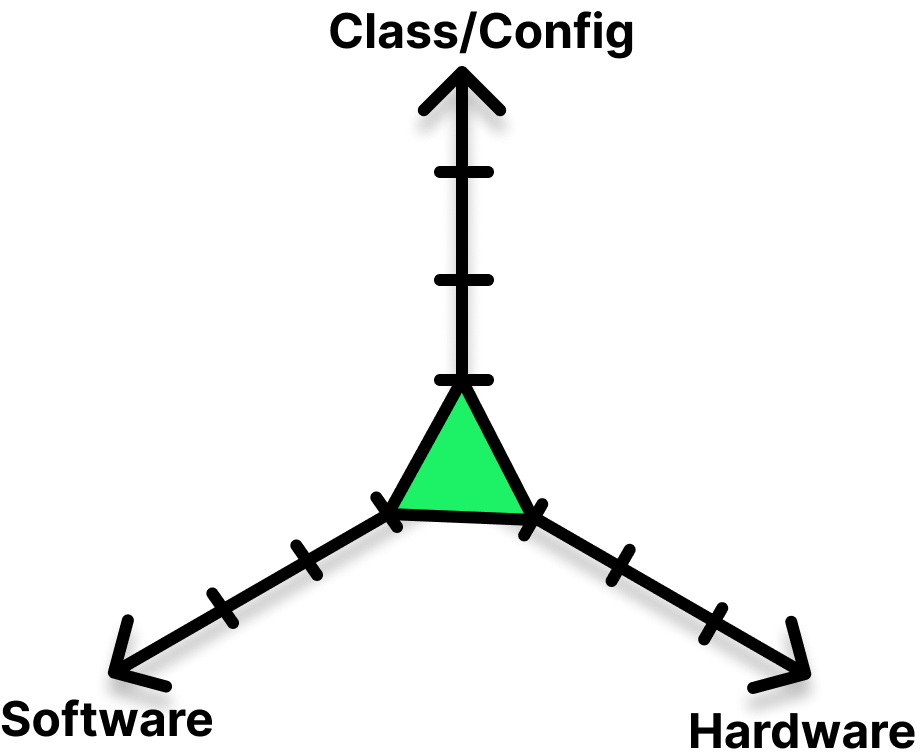
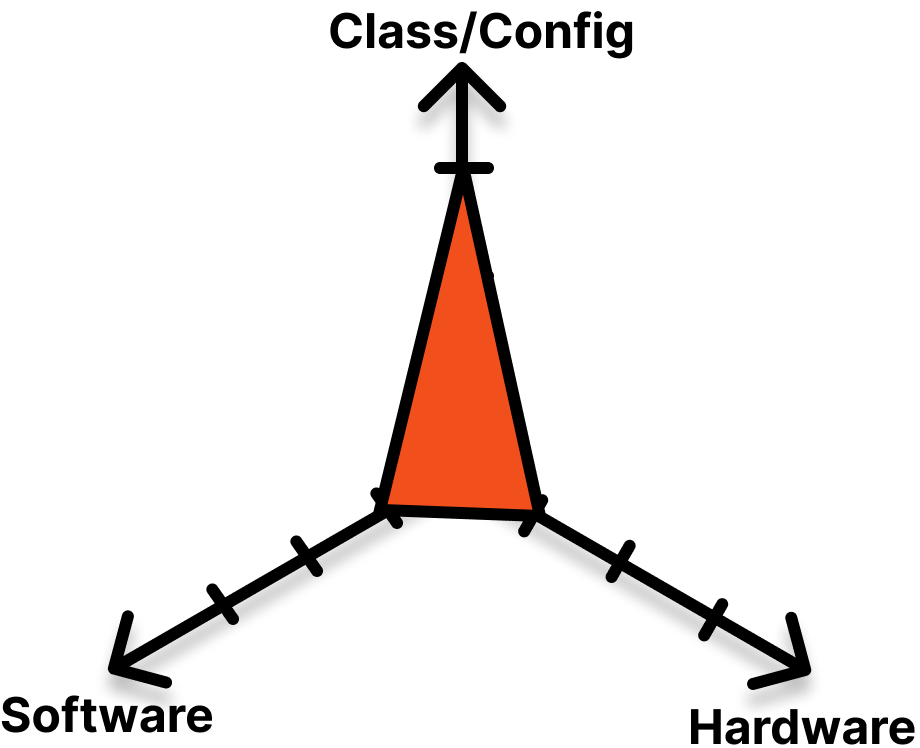
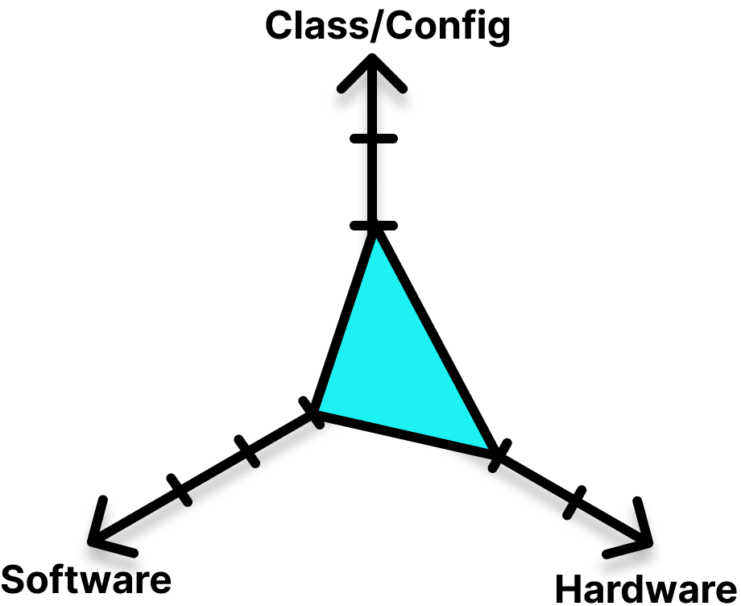
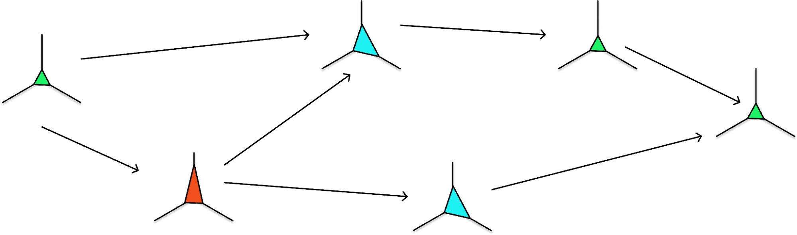

# Heterogeneous tasks

One of the most powerful features of Union Cloud is the ability to run widely differing computational workloads as tasks with a single workflow.

Because of the way that Union Cloud and Flyte are architected, tasks within a single workflow can differ along many dimensions.
While the total number of ways that tasks can be configured is quite large we can summarize the options into three categories:

* **Task variant**: These include standard Python tasks, map tasks, raw container tasks, and many specialized plugin tasks.
* **Software environment**: Define the task container image, dependencies, and even programming language.
* **Hardware environment**: Define the resource requirements (processor numbers, storage amounts) and machine node characteristics (CPU and GPU type).



**_The three dimensions along which a task definition can vary_**

# Mix and match task characteristics

Along these three dimensions, you can mix and match characteristics to build a task definition that performs exactly the job you want, while still taking advantage of all the features provided at the workflow level like output caching, versioning, and reproducibility.

<div class="row">
  <div class="column">
    
  </div>
  <div class="column">
    
  </div>
  <div class="column">
    
  </div>
</div>

**_Task definitions can vary independently along (almost) any dimension_**

Tasks with diverse characteristics can be combined into a single workflow.
For example, a workflow might contain:

* A **Python task running on your default container image** with default dependencies and default resource and hardware profile.
* A **Python task running on a container image with additional dependencies** configured to run on machine nodes with a specific type of GPU.
* A **raw container task** running a Java process.
* A **plugin task** running a Spark job that spawns its own cluster-in-a-cluster.
* A **map task** that runs multiple copies of a Python task in parallel.



**_A workflow consisting of heterogeneous tasks_**

The ability to build workflows from such a wide variety of heterogeneous tasks makes Union Cloud uniquely flexible.
In the sections below we will explore the various ways that you can customize and configure your tasks to leverage this flexibility in powerful ways.

::: info Note

Not all parameters are compatible: For example, with specialized plugin task types some configurations are not available (this depends on task plugin details).

:::


# Task variant

Task variants include:

* **`PythonFunctionTask`**: This Python class represents the standard default task.
It is the type that is created when you use the `@task` decorator.
* **`ContainerTask`**: This Python class represents a raw container.
It allows you to install any image you like, giving you complete control of the task.
* **Map tasks**: The map task functionality enables you to run multiple copies of the same task across multiple containers in parallel.
* **Specialized plugin tasks**: These include both specialized classes and specialized configurations of the `PythonFunctionTask`.
They implement integrations with third-party systems.


## PythonFunctionTask

This is the task type that is created when you add the `@task` decorator to a Python function.
It represents a Python function that will be run within a single container. For example::

```python
@task
def get_data() -> pd.DataFrame:
    """Get the wine dataset."""
    return load_wine(as_frame=True).frame

```

See the [Python Function Task example](https://github.com/unionai-oss/union-cloud-docs-examples/tree/main/python_function_task).

This is the most common task variant and the one that, thus far, we have focused on in this documentation.


## ContainerTask

This task variant represents a raw container, with no assumptions made about what is running within it.
Here is an example of declaring a `ContainerTask`:

<!-- TODO: Example code -->

The `ContainerTask` enables you to include a task in your workflow that executes arbitrary code in any language, not just Python.

<!--TODO: Besides support for other languages, there are other reasons to use a container task. Mention them her -->

See the [Container Task example](https://github.com/unionai-oss/union-cloud-docs-examples/tree/main/container_task).


## Map tasks

A map task allows you to execute many instances of a task within a single workflow node.
This enables you to execute a task across a set of inputs without having to create a node for each input, resulting in significant performance improvements.

Map tasks find application in various scenarios, including:

* When multiple inputs require running through the same code logic.
* Processing multiple data batches concurrently.
* Conducting hyperparameter optimization.

Just like normal tasks, map tasks are automatically parallelized to the extent possible given resources available in the cluster.

<!-- TODO: example code-->

See:
* The [Map Task example](https://github.com/unionai-oss/union-cloud-docs-examples/tree/main/map_task).
* [Map Tasks](https://docs.flyte.org/projects/cookbook/en/latest/auto_examples/advanced_composition/map_task.html#map-task) in the Flyte docs


## Specialized plugin task classes and configs

Union Cloud supports a wide variety of plugin tasks.
Some of these are enabled as specialized task classes, others as specialized configurations of the default `@task` (`PythonFunctionTask`).

They enable things like:

* Querying external databases (AWS Athena, BigQuery, DuckDB, SQL, Snowflake, Hive).
* Executing specialized processing right in Union Cloud (Spark in virtual cluster, Dask in Virtual cluster, Sagemaker, Airflow, Modin, Ray, MPI and Horovod).
* Handing off processing to external services(AWS Batch, Spark on Databricks, Ray on external cluster).
* Data transformation(Great Expectations, DBT, Dolt, ONNX, Pandera).
* Data tracking and presentation  (MLFlow, Papermill).

See the [Integration section](https://docs.flyte.org/projects/cookbook/en/latest/integrations.html) of the Flyte documentation for examples.


# Software environment

Another axis along which you can customize a task is the software environment in which your task code executes.

Unlike some other orchestration platforms, Union Cloud allows each task in a workflow to have its own container image and therefore its own set of dependencies.

Depending on your needs, there are a number of ways to create tasks with their own custom images:

* `ImageSpec`.
* `PodTemplate`.
* CI/CD set up.


## ImageSpec

Using `ImageSpec` in the `@task` declaration lets you define the container image for a task directly in the task code.

See [GPU usage example](
https://github.com/unionai-oss/union-cloud-docs-examples/tree/main/gpu_usage) (It uses an `ImageSpec`).

## PodTemplate

Using a `PodTemplate` in a `ContainerTask` lets you define the container image for the task.

See [`PodTemplate` example](
https://github.com/unionai-oss/union-cloud-docs-examples/tree/main/pod_template)

## CI/CD
Organizing your workflow and task registration (Typically using a CI/CD system) so that you separately register tasks with different container images using command line tools.

<!-- See [CI/CD example]() -->

# Hardware environment

You can also customize the hardware environment in which your task code executes.

Depending on your needs, there are two different of ways to define and register tasks with their own custom hardware requirements:

* Configuration in the @task decorator
* Defining a PodTemplate

## Using the `@task` decorator

Control request and limits on

* CPU number
* GPU number
* Memory size
* Storage size
* Ephemeral storage size

<!-- TODO: Example code -->

See the [GPU usage example](
https://github.com/unionai-oss/union-cloud-docs-examples/tree/main/gpu_usage)

Additionally, the following capabilities are currently in development:

* Specify a GPU accelerator device.
* Specify partial GPU percentage.

## Using PodTemplate

If your needs are more complex, you can use Kubernetes-level configuration to constrain a task to only run on a specific machine type.

This requires that you coordinate with Union Cloud to set up the required machine types and node groups with the appropriate node assignment configuration (node selector labels, node affinities, taints, tolerations, etc.)

In your task definition you then use a `PodTemplate` that that uses the matching node assignment configuration to make sure that the task will only be scheduled on the appropriate machine type.

<!-- TODO: Example code -->

See the [`PodTemplate` example](
https://github.com/unionai-oss/union-cloud-docs-examples/tree/main/pod_template)