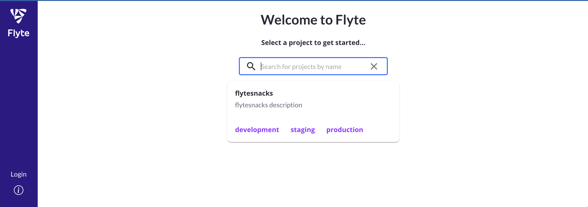

# Running in a local cluster

## Running in a local Kubernetes cluster

Ultimately you will be running your workflows in a Kubernetes cluster in Union Cloud. But it can be handy to try out a workflow in a cluster on your local machine. Flyte enables this.

First, ensure that you have [Docker ](https://www.docker.com/products/docker-desktop/)(or a similar OCI-compliant container engine) installed locally and that _the daemon is running_.

Then start the demo cluster using `uctl`:

```shell
$ uctl demo start
```

### Configuration

When `uctl` starts the cluster in your local container engine it also writes configuration information to the directory `~/.uctl/`.

Most importantly, it creates the file `~/.uctl/config-sandbox.yaml`. This file holds (among other things) the location of the Kubernetes cluster to which we will be deploying the workflow:

```yaml
admin:
  endpoint: localhost:30080
  authType: Pkce
  insecure: true
console:
  endpoint: http://localhost:30080
logger:
  show-source: true
  level: 0
```

Right now this file indicates that the target cluster is your local Docker instance (`localhost:30080`), but later we will change it to point to your Union Cloud cluster.

Later invocations of `uctl` or `pyflyte` will need to know the location of the target cluster. This can be provided in two ways:

1. Explicitly passing the location of the config file on the command line
   * `uctl --config ~/.uctl/config-sandbox.yaml <command>`
   * `pyflyte --config ~/.uctl/config-sandbox.yaml <command>`
2. Setting the environment variable `FLYTECTL_CONFIG`to the location of the config file:
   * `export FLYTECTL_CONFIG=~/.uctl/config-sandbox.yaml`

::: info Note

In this guide, we assume that you have set the`FLYTECTL_CONFIG` environment variable in your shell to the location of the configuration file.

:::

### Start the workflow

Now you can run your workflow in the local cluster simply by adding the `--remote` flag to your `pyflyte` command:

```shell
[~/wine-classification]:wine-classification
$ pyflyte run --remote \
          workflows/example.py \
          training_workflow \
          --hyperparameters '{"C": 0.1}'
```

The output supplies a URL to your workflow execution in the Flyte console. It should look something like this:

```shell
Go to http://localhost:30080/console/projects/flytesnacks/domains/development/executions/f6ac3844ff43b4be69a9 to see execution in the console.
```

### Inspect the results

Navigate to the URL produced by `pyflyte run`. This will take you to the Flyte console, the web UI used to manage Flyte entities such as tasks, workflows, and executions:



There are a few features of the Flyte console worth pointing out:

* The **Nodes** view shows the list of tasks executing in sequential order.
* The right-hand panel shows metadata about the task execution, including logs, inputs, outputs, and task metadata.
* The **Graph** view shows the execution graph of the workflow, providing visual information about the topology of the graph and the state of each node as the workflow progresses.
* The **Timeline** view shows how long each part of the execution takes.
* On completion, you can inspect the outputs of each task, and ultimately, that of the overarching workflow.

The container image that you create must be pushed to a registry from which your Union Cloud will pull it when you register your workflow. In order for Union Cloud to pull the image it either has to be in a public registry or a private one for which Union Cloud has permission.

## Workflow code and dependencies

Recall that when you ran the example in your local Python environment you installed the required dependency (`flytekit`, `pandas`, and `scikit-learn`) as you would with any Python project:

```shell
pip install -r requirements.txt
```

When you invoked `pyflyte run`, the `@task` and `@workflow` code was able to access the `flytekit`, `pandas` and `scikit-learn` libraries because they were already present in your local Python environment.

However, when you ran the same code on the local Kubernetes cluster using `pyflyte run --remote` a bit of sleight-of-hand was involved.

The local cluster (as with any Kubernetes cluster) requires an image to instantiate the container in which the code will be run.
When you invoked `flytectl demo start` a [demo container image](https://github.com/flyteorg/flytekit/blob/master/Dockerfile) was pulled and started in your local Docker.
**That image already contained the required libraries **_**and this was not a coincidence**_**.**

The demo cluster purposely comes with these libraries installed specifically to facilitate this getting started guide.
While this is convenient, it does mean that you might initially miss an important point about workflow deployment:
**In general, you need to create and deploy a container image that contains the Python dependencies required by your workflow code.**
**We show you how to do this in the next section**, [Setting up the project on Union Cloud](setting-up-the-project-on-union-cloud).
