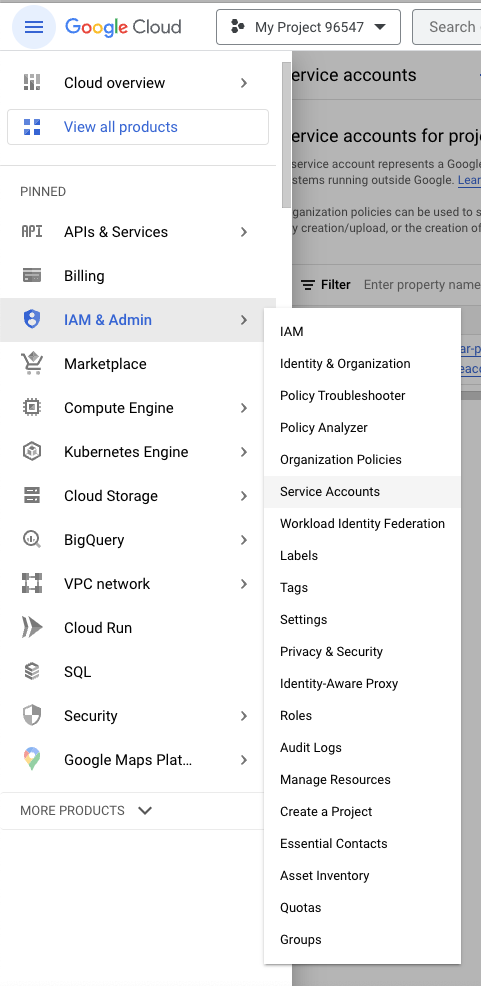
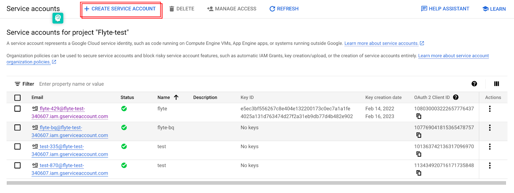
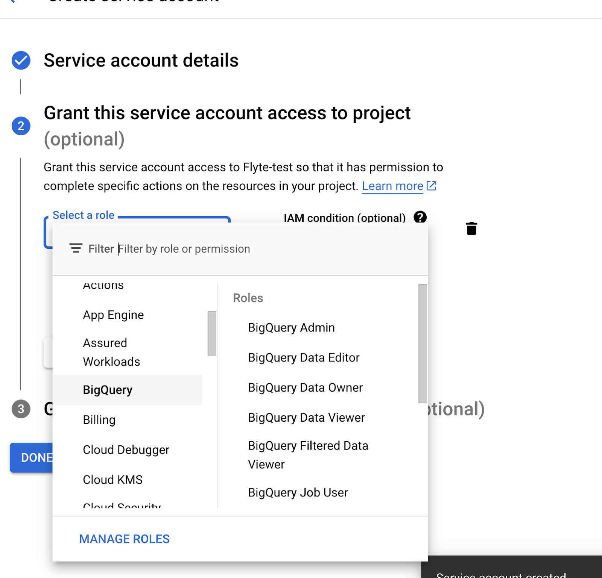
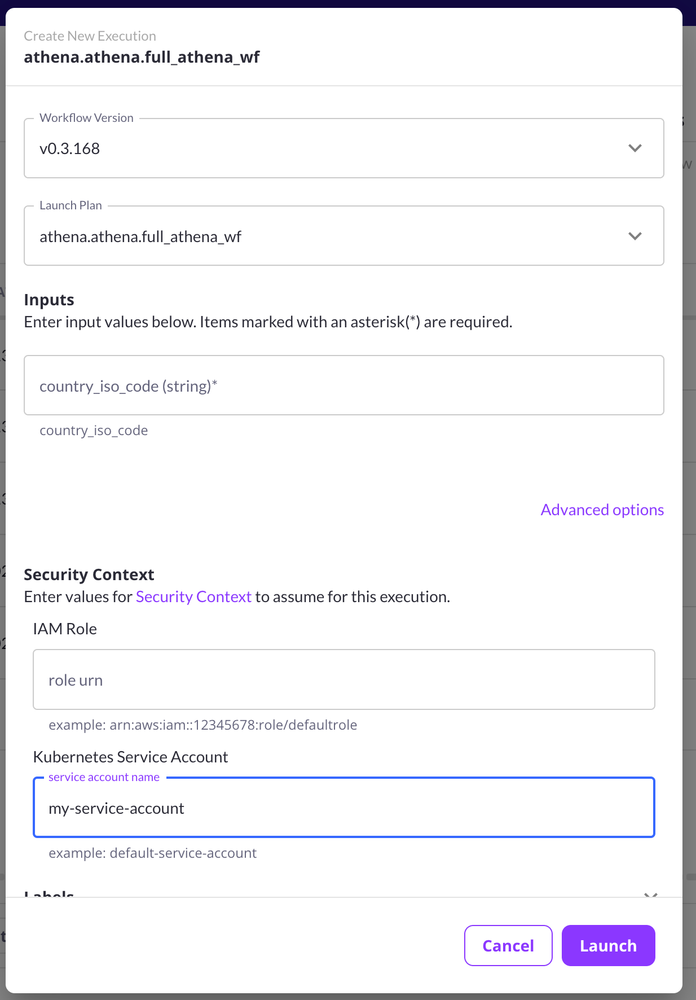

# Enabling BigQuery

For customers using the Google Cloud Platform as the data plane, Union Cloud lets you easily pull data from BigQuery into your workflows.

## Enabled by default

For most users on GCP, access to BigQuery should be enabled by default and bound to the default Google Service Account (referred to in this documentation as `<UserFlyteGSA>`).

The following directions are provided in case you wish to bind the BigQuery service to a different GSA.

## Create a service account for BigQuery access

To enable access to BigQuery, you will need to set up a service account specifically for that purpose within your Google Cloud project:

* Log in to the Google Cloud console.
* Navigate to **IAM & Admin > Service Accounts**:



* Select **Create Service Account**:



* Fill in the service account details and ensure that it has access to BigQuery:



Alternatively, you can perform the same operation using the command line like this:

```shell
$ gcloud projects add-iam-policy-binding \
         <project_id> \
         --member "serviceAccount:<account-id>@<project_id>.iam.gserviceaccount.com" \
         --role "roles/bigquery.admin"
```

For example, if your service account ID is `my-service-account` and your project ID is `my-project` then the command would be:

```shell
$ gcloud projects add-iam-policy-binding \
         my-project \
         --member "serviceAccount:my-service-account@my-project.iam.gserviceaccount.com" \
         --role "roles/bigquery.admin"
```

## Bind the service account to your workflow in Union Cloud

When your workflow executes it will need to know which service account to use to access BigQuery.
You can specify the service account at the individual execution level, the workflow level, or the project level.

### Bind the service account at the execution level

You can bind the service account at the execution level when you launch the execution either in the web console or on the command line.

In the Union Cloud console, navigate to the workflow within which you want to access BigQuery and select **Launch Workflow**.
The **Create New Execution** dialog will appear.
Select **Advanced options** and, under **Security Context > Kubernetes Service Account**, enter the name of the service account you created above.



On the command line you would do the same thing by invoking `pyflyte run` with the `--service-account` argument:

```shell
$ pyflyte run --remote --service-account my-service-account my.py my-workflow
```

### Bind the service account at the workflow level

Alternatively, if you want a specific workflow to always use a specific service account then, you can bind the account at the workflow level upon registration:

```shell
$ pyflyte register --service-account my-service-account my.py
```

### Bind the service account at the project level

Alternatively, if all workflows within a project need access to BigQuery, you set the service account to be the default at the project level.

Create a YAML file (let's call it `attr.yaml`) with the following contents, substituting your `domain`, `project` and `k8s_service_account` (that's the service account you created above) appropriately:

```yaml
domain: development
project: my-project
security_context:
    run_as:
        k8s_service_account: my-service-account
```

Now, run the following command:

```shell
$ uctl update workflow-execution-config --attrFile attr.yaml
```

## Reference the service account in your code

In your code, when you create a BigQuery task you simply pass in the name of the service account as the `ProjectID` in the `BigQueryConfig`:

```python
bigquery_task_no_io = BigQueryTask(
    name="sql.bigquery.no_io",
    inputs={},
    query_template="SELECT 1",
    output_schema_type=None,
    task_config=BigQueryConfig(ProjectID="my-service-account"),
)
```
