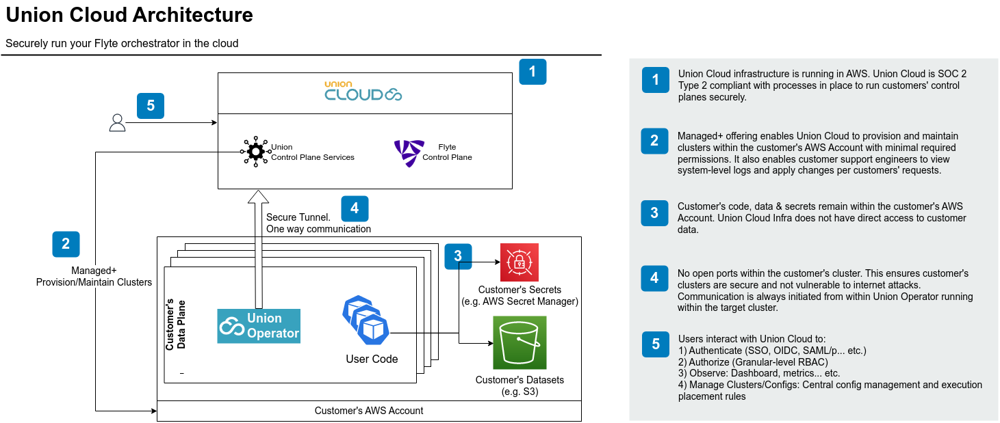

# New platform architecture

The Union Cloud architecture consists of two virtual private clouds, referred to as planes:

* Control plane
  * Runs within the Union Cloud AWS account.
  * Provides the user interface through which users can access authentication, authorization, observation, and management functions.
  * Responsible for placing executions onto execution plane clusters and performing other cluster control and management functions.
* Data plane
  * Runs within your AWS or GCP account.
  * Clusters are provisioned and managed by the control plane through a resident Union operator with minimal required permissions.
  * Your secrets and datasets reside here. Union Cloud infrastructure does not have direct access to these.
  * All your workflow and task executions are performed here.

Union operates one control plane for each supported region.
That control plane supports all data planes within that region.
You can choose in which region to locate your data plane.
Currently, Union Cloud supports `us-west`, `us-east`, `eu-west`, and `eu-central`.
More regions are being added.

## Security

The Union Cloud hybrid architecture lets you maintain ultimate ownership and control of your data and compute infrastructure while enabling Union to handle the details of managing that infrastructure.

Management of the data plane is mediated by a dedicated operator (the Union operator) resident on that plane.
This operator is designed to perform its functions with only the very minimum set of required permissions.
It allows the control plane to spin up and down clusters and provides Union's support engineers with access to system-level logs and the ability to apply changes as per customer requests. It _does not_ provide direct access to secrets or data.

In addition, communication is always initiated by the Union operator in the data plane toward the Union Cloud control plane, not the other way around.
This further enhances the security of your data plane.

Union Cloud is SOC-2 Type 2 certified. A copy of the audit report is available upon request.
