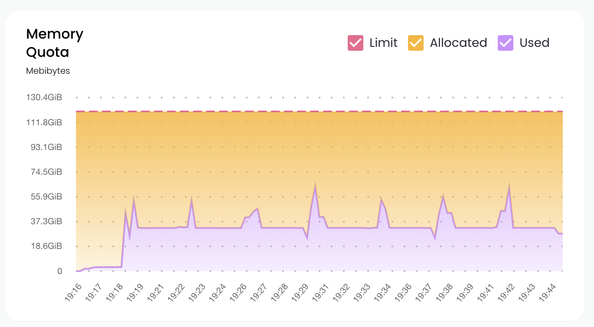

# Release Notes

## v1.0.0 (May 2023)

Union Cloud is now in Expanded Availability!
This version 1.0.0 is packed with new features, improvements, and configuration options.

### Highlights

* **Task-Level Monitoring** to view resource consumption of running tasks in real time.
* **Role-Based Access Control** supporting fine-grained (project-domain level) permissions.
* **Flyte 1.6** with on-the-fly image building, UI-based runtime metrics, and tons more.
* **European Regions** deployable (eu-central and eu-west). Reach out to us to add a region.
* **In-App Feedback Capture** to quickly create support tickets and provide feedback.

### [Task-Level Monitoring](web-console/task-level-monitoring)

For any task execution on Union Cloud, it is now possible to visualize the resource limits, allocation, and actual usage in real time (and historically, subject to a retention window).
The resources currently tracked are:

* Memory Quota (shown below)
* CPU Cores Quota
* GPU Memory Utilization
* GPU Utilization

Task-Level Monitoring is designed to provide a feedback loop between [Flyte resource requests](https://docs.flyte.org/projects/cookbook/en/latest/auto/deployment/customizing_resources.html) and what actually happens in the cluster, enabling the following use cases:

* Identification of cost-savings and performance improvement opportunities, such as idle GPU cores or low memory utilization.
* Headroom estimation for repeated jobs where the input data is monotonically increasing.
* Qualitative analysis of tasks which failed with an out-of-memory error.



### [Role-Based Access Control](administration/user-management)

In addition to shipping with the standard RBAC Roles (`Viewer`, `Contributor`, and `Admin`), Union Cloud now offers fine-grained flexibility to grant each user specific permissions within the scope of specific projects and/or domains (development, staging, production).
This enables use cases like the following:

* Limit machine applications (for example, CI bots) to only have permission to register workflows, tasks, and launch plans without being able to trigger executions.
* Restrict some human users to only have permissions to create executions without being able to register workflows, tasks, and launch plans.

### Flyte 1.6

The latest version of Flyte is packed with new functionality:

* **Runtime Metrics:** the Timeline view now contains more granular intra-task state transition details, allowing inference about potential issues such as scheduling contention or prolonged image pull times.
* **ImageSpec:** users can now define and build container images for Flyte tasks and workflows by specifying the necessary components directly inline (without the need for a Dockerfile).
* **Prettified CLI**: the CLI now leverages [rich-click](https://github.com/ewels/rich-click) for improved and more visually appealing output.
* **Flyte Decks Execution Insights**: Flyte Decks now generates a comprehensive timeline graph that showcases the duration of different components involved in task execution.
* **Lazy loading of Flytekit Dependencies**: Flytekit now handles dependency loading more efficiently and dynamically, reducing memory usage and enhancing overall performance.
* **PyTorch Elastic Training (torchrun)**: Flyte now offers seamless support for distributed training using PyTorch elastic (torchrun), allowing you to efficiently harness distributed resources and tackle complex machine learning tasks.

See the Flyte 1.6 [blog post](https://flyte.org/blog/flyte-1-6-runtime-metrics-ui-imagespec-external-backend-plugins-and-more) for a full breakdown.

### European Regions

We've launched availability of two new regions in Europe, bringing our list of supported regions to:

* us-east
* us-west
* eu-west
* eu-central

### In-App Feedback Capture

Union Cloud can now collect your bug reports valuable feedback!
To file a ticket, click the `Feedback` button at the bottom-right of the UI and follow the on-screen instructions.
The user feedback is reviewed by the team on a daily basis and taken extremely seriously!

## v0.0.49 (Mar 2023)

Union Operator [v0.0.49](https://github.com/unionai/unionoperator/releases/tag/v0.0.49)

* Stability improvements and bugfixes

In order to upgrade to this version:

1.  Update your `values.yaml`:

    ```yaml
    union:
      enabled: true
      enableTunnelService: true
      ...
    ```
2.  Perform the following where you initially deployed following the [EKS](https://docs.aws.amazon.com/eks/?icmpid=docs_homepage_containers) or [GKE](https://cloud.google.com/kubernetes-engine/docs) guide:

    ```shell
    $ helm repo update
    $ helm upgrade -n union -f values.yaml --create-namespace union-operator unionai/union-operator
    ```

## v0.0.35 (Dec 2022)

Union Operator [v0.0.35](https://github.com/unionai/unionoperator/releases/tag/v0.0.35)

* Fixed sync config issue which can delay updates from union services.

In order to upgrade to this version, perform the following where you initially deployed following the [EKS](https://docs.aws.amazon.com/eks/?icmpid=docs_homepage_containers) or [GKE](https://cloud.google.com/kubernetes-engine/docs) guide:

```shell
$ helm repo update
$ helm upgrade -n union -f values.yaml --create-namespace union-operator unionai/union-operator
```

The upgrade process is not expected to be disruptive and should not interrupt your running workflow executions.

## v0.0.33 (Nov 2022)

Union Operator [v0.0.33](https://github.com/unionai/unionoperator/releases/tag/v0.0.33) includes updated support for [fast registration](getting-started/deploying-the-project-on-union-cloud#fast-registration).
In order to enable it, you'll need to

1.  Update your `values.yaml`:

    ```yaml
    union:
      enableTunnelService: true
      ...
    ```
2.  Upgrade your existing installation, where you initially deployed following the [EKS](https://docs.aws.amazon.com/eks/?icmpid=docs_homepage_containers) or [GKE](https://cloud.google.com/kubernetes-engine/docs) guide:

    ```shell
    $ helm repo update
    $ helm upgrade -n union -f values.yaml --create-namespace union-operator unionai/union-operator
    ```

The upgrade process is not expected to be disruptive and should not interrupt your running workflow executions.
