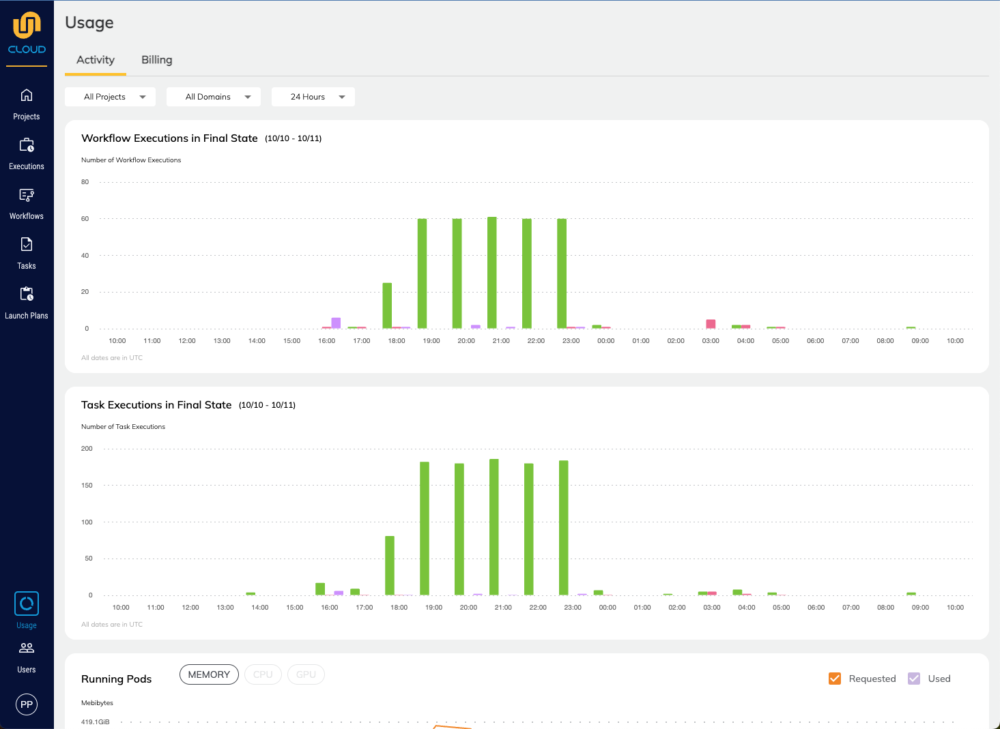
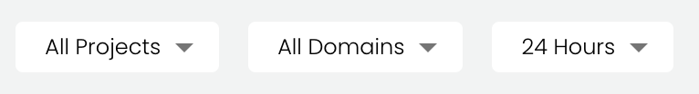
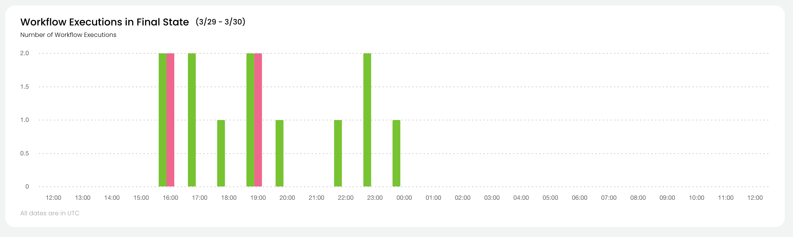
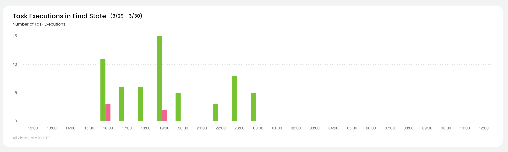
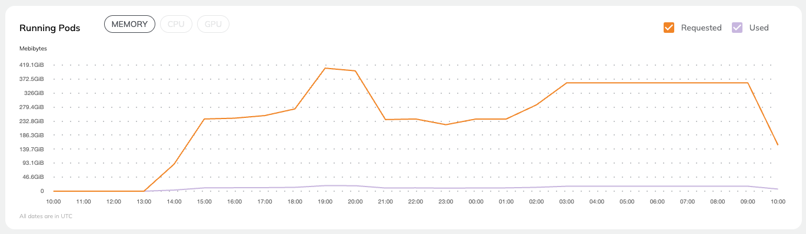
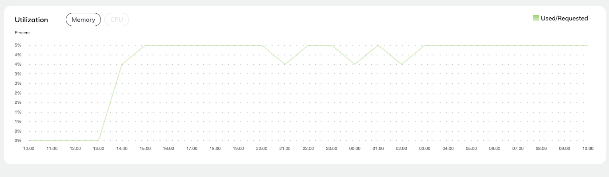
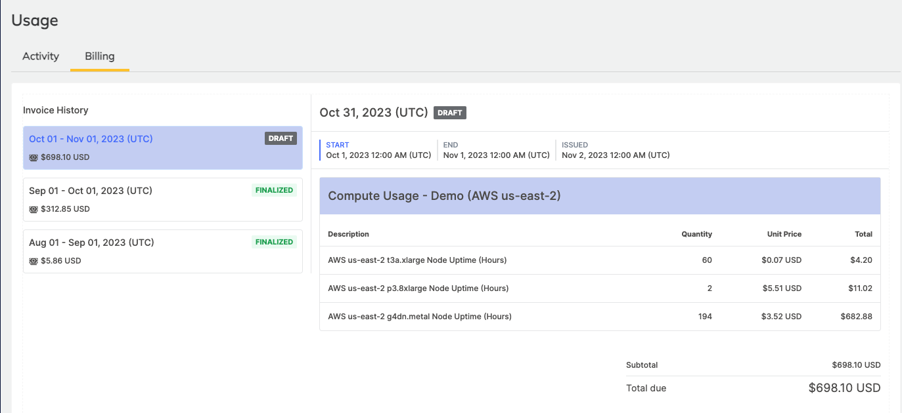

# Usage

Select **Usage** in the sidebar to open a view showing the overall health and utilization of your Union Cloud installation.

Two tabs are available: [**Activity**](#activity) and [**Billing**](#billing).

## Activity

This tab displays information about workflows, tasks, resource consumption, and resource utilization.

### Filter

The drop-downs at the top lets you filter the charts below by project, domain and time period:

* **Project**: Dropdown with multi-select over all projects. Making a selection recalculates the charts accordingly. Defaults to **All Projects**.
* **Domain**: Dropdown with multi-select over all domains (for example, **development**, **staging**, **production**). Making a selection recalculates the charts accordingly. Defaults to **All Domains**.
* **Time Period Selector**: Dropdown to select the period over which the charts are plotted. Making a selection recalculates the charts accordingly. Defaults to **24 Hours**. All times are expressed in UTC.

### Workflow Executions in Final State

This chart shows the overall status of workflows at the project-domain level.

For all workflows in the selected project and domain which reached their final state during the selected time period, the chart shows:

* The number of successful workflows.
* The number of aborted workflows.
* The number of failed workflows.

See [Workflow States](https://docs.flyte.org/en/v1.0.0/concepts/state_machine.html#workflow-states) for the precise definitions of these states.

### Task Executions in Final State

This chart shows the overall status of tasks at the project-domain level.

For all tasks in the selected project and domain which reached their final state during the selected time period, the chart shows:

* The number of successful tasks.
* The number of aborted tasks.
* The number of failed tasks.

See [Task States](https://docs.flyte.org/en/v1.0.0/concepts/state_machine.html#task-states) for the precise definitions of these states.

### Running Pods

This chart shows the absolute resource consumption for

* Memory (MiB)
* CPU (number of cores)
* GPU (number of cores)

You can select which parameter to show by clicking on the corresponding button at the top of the chart.
You can also select whether to show **Requested**, **Used**, or both.

### Utilization

This chart shows the percent resource utilization for

* Memory
* CPU

You can select which parameter to show by clicking on the corresponding button at the top of the chart.

## Billing

The **Billing** tab displays the cost of running workflows and tasks in your Union Cloud installation.

